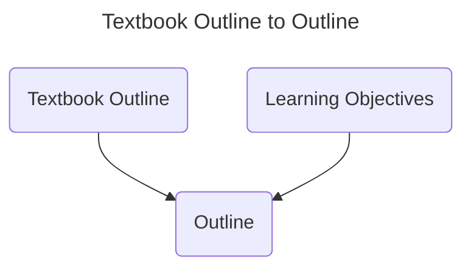

<!--more-->

## Introduction

When we are preparing lessons or reviewing subjects. We may want to create a power point to help us learn the knowledge, or teach others the knowledge.

I am going to help you create the PowerPoint with GPT-3.5/GPT-4. From get the content to structure the slides. Also, some basic ideas about knowledge base.

## Structure

Before we start making the PowerPoint, we better review what types of structure we have. Since, we need introduce the AI what type of PowerPoint we would like, or the combination of types we want.

### Problem-Solution
- **Description:** Introduce a problem and propose a solution to explain the topic and clarify key concepts.
- **Pros:** Helps the audience better understand the topic and facilitates concept explanation and presentation.
- **Cons:** If the problem is not compelling, the audience may lose interest.

### Timeline
- **Description:** Arrange historical events or processes in chronological order to show the development and evolution of the course.
- **Pros:** Helps the audience better understand and remember historical events and the evolution process.
- **Cons:** May seem too linear and lack creativity, and it is important to maintain the audience's interest.

### Speaker
- **Description:** Introduce the speaker's background, experience, and perspectives to help the audience understand and trust the speaker.
- **Pros:** Enhances the speaker's credibility and helps to establish a good relationship between the speaker and the audience.
- **Cons:** May overshadow the topic and lose the focus of the presentation.

### Classification
- **Description:** Divide the topic into different categories or types to organize and summarize key concepts and themes.
- **Pros:** Helps summarize knowledge and makes it easier for the audience to understand and remember.
- **Cons:** Classification may be too abstract, and it is necessary to ensure that the audience understands and accepts the classification method.

### Data-Driven
- **Description:** Present data, charts, and statistical information to support the topic and concepts.
- **Pros:** Visualization of data and information makes it easier for the audience to understand and accept.
- **Cons:** May seem too technical and dry, and it is important to keep the audience interested and focused.

### Comparison/Contrast
- **Description:** Compare and contrast different concepts or topics, emphasizing their similarities and differences.
- **Pros:** Helps to understand and remember the relationship between different concepts or topics.
- **Cons:** Need to carefully select comparison or contrast content to avoid being too trivial or abstract.

### Narrative
- **Description:** Use stories or cases to illustrate the course content.
- **Pros:** Vivid and interesting, easy to resonate with the audience and emotionally engage them.
- **Cons:** Need to pay attention to the relevance and effectiveness of the story plot and case, and avoid exaggeration or forced association.

### Question/Answer
- **Description:** Set questions and provide answers and explanations, similar to the problem-solving structure but more interactive.
- **Pros:** Increases audience participation and interaction, helps the audience better understand and remember the content.
- **Cons:** Need to ensure the quality and relevance of the questions and answers to avoid boring or confusing the audience.

### SWOT
- **Description:** **S**trengths, **W**eaknesses, **O**pportunities, and **T**hreats. Used to analyze the strengths, weaknesses, opportunities, and threats of a company or organization.
- **Pros:** Helps to understand the current situation and future development trends of a company or organization.
- **Cons:** Need to ensure that the content selection and analysis are comprehensive and accurate, and avoid false or one-sided situations.

### Pyramid
- **Description:** Start with the most important content and gradually expand downward, guiding the audience's attention and understanding.
- **Pros:** Layer by layer, helps the audience better understand and remember the topic and concepts.
- **Cons:** Need to maintain the audience's interest and attention, and avoid monotony or boredom.

### Spiral
- **Description:** Expand from one topic and gradually extend to other related topics.
- **Pros:** Shows the correlation and extension of the topic and concept, helps to increase the audience's understanding and memory.
- **Cons:** Need to maintain logic and clarity, and avoid being too confusing or disorderly.

### Presentation
- **Description:** Based on traditional speech structures, including opening remarks, main body, summary, etc.
- **Pros:** Helps to build a complete presentation framework and logic, helps the audience better understand and remember the topic and content.
- **Cons:** Need to maintain the audience's interest and attention, and avoid monotony or boredom.

## Content Management

For any type of structures, we still need to find out the Main Content. What I main is you should make/have the Main Content first. You should just copping content into the PowerPoint, not writing with PowerPoint.


The reason for that is we can convert our Main Content into various forms easily.


It can save time. Further, the school can build a common knowledge base to reduce teachers' document work, duplicate work, and get uniform and efficient teaching quality.

Then, let's begin!

## Build an Outline

When we are writing the Main Content, it's better to start with an Outline, because in the writing process, we are adding "details". So, If we start from the least "detailed" one. We can save our time in summarizing Main Content into Outline.


### Example

Let's use our old friends Astrophysics. I used [**ChatPDF**](https://www.chatpdf.com/) to give an outline from the textbook.

```md
# I. Introduction
- Definition of astrophysics as a multidisciplinary field that studies celestial objects using theoretical and observational techniques.
- Importance of astrophysics for understanding the physical principles that govern the behavior of celestial objects and their practical applications.
- Key questions in astrophysics such as the nature of dark matter and dark energy, extraterrestrial life, and the ultimate fate of the universe.

# II. Celestial Objects
- Description of the solar system as a collection of planets orbiting around the Sun.
- Astronomical distances and methods for measuring them such as parallax or redshifts.
- Other objects in the solar system such as moons, rings, asteroids, comets, and dwarf planets.
- Exoplanets (planets outside our solar system) and their discovery.
- The role of telescopes and other instruments for observing celestial objects at different wavelengths such as radio, infrared, visible, ultraviolet, X-ray, or gamma-ray.
- The importance of space missions for studying objects beyond our solar system such as the Hubble Space Telescope or the Kepler mission.
- The discovery of gravitational waves and their use for studying black holes and other astrophysical phenomena.

# III. Stellar Astrophysics
- Luminosity as a measure of a star's energy output related to its mass, radius, and temperature through stellar models.
- Apparent brightness as a measure of how bright a star appears from Earth affected by both luminosity and distance but also by other factors such as interstellar dust or variability over time.
- The Hertzsprung-Russell diagram (HR diagram) used to classify stars based on their spectral type, luminosity class, temperature but also reveal other properties such as age or chemical composition.
- Variable stars (stars that exhibit changes in brightness over time), luminosity functions (distributions of luminosities among a population of stars), binary stars (pairs of stars that orbit around a common center).
- The role of nuclear fusion reactions in powering stars and producing heavier elements through nucleosynthesis.
- The connection between stellar evolution and the chemical enrichment of galaxies over time.
- The study of supernova explosions as probes for measuring cosmic distances or studying the properties of dark energy.
- The search for habitable planets and signs of life beyond Earth using techniques such as transit photometry or spectroscopy.

# IV. Galaxies and Cosmology
- Description of galaxies as large systems of stars, gas, and dust held together by gravity and classified based on their shape (spiral, elliptical, irregular) or other properties such as their mass or activity.
- Active galactic nuclei (regions at the centers of galaxies that emit large amounts of energy) and their connection to supermassive black holes.
- Gravitational lensing (the bending of light by massive objects such as galaxies) and its use for studying dark matter content in galaxies.
- Large-scale structure (patterns in the distribution of galaxies on scales larger than individual galaxies) and its use for studying the evolution of the universe as a whole.
- The connection between galaxy properties such as mass, morphology, or activity with their environment (e.g., clusters, filaments) or cosmic epoch (e.g., early universe).
- The study of cosmic microwave background radiation (CMB) as a relic from the early universe that can provide information about its geometry, age, and composition.
- Alternative models to the standard cosmological model such as modified gravity theories or dark matter alternatives.

# V. Conclusion
- Summary of key points covered in the Option D Astrophysics PDF file.
- Importance of astrophysics for further study in related fields such as astronomy, cosmology, or planetary science but also for broader scientific concepts such as thermodynamics, electromagnetism, or quantum mechanics.
- Practical applications of astrophysics such as developing new technologies for space exploration or improving our understanding of climate change.
- Cultural and philosophical significance of astrophysics by providing insights into our place in the universe and our relationship to other living beings.
- Future directions in astrophysics such as the study of gravitational waves, the search for exoplanets, or the development of new observational facilities.
- The importance of interdisciplinary collaborations and diversity in astrophysics for advancing scientific knowledge and addressing societal challenges.
- The role of science communication and outreach in promoting public engagement with astrophysics and inspiring future generations of scientists.

# VI. Additional Topics
- The study of black holes and their properties such as event horizons, accretion disks, or jets.
- The role of magnetic fields in shaping the behavior of celestial objects such as stars, galaxies, or accretion disks.
- The study of cosmic rays (high-energy particles that originate from outside the solar system) and their impact on Earth's atmosphere and technology.
- The search for gravitational waves from sources other than black hole mergers such as neutron star mergers or supernova explosions.
- The study of astrochemistry (the chemistry of molecules in space) and its connection to the formation of stars and planets.
- The role of astrobiology in studying the origin, evolution, and distribution of life in the universe.

# VII. References
- List of key references cited throughout the PDF file for further reading or exploration.
- Suggestions for additional resources such as textbooks, online courses, or scientific journals related to astrophysics.

# VIII. Glossary
- Definition of key terms used throughout the PDF file related to astrophysics and cosmology.
- Examples of how these terms are used in context within the PDF file.

# IX. Acknowledgments
- Recognition of individuals or organizations that contributed to the development or funding of the PDF file.
- Contact information for feedback or inquiries about the PDF file or related topics in astrophysics and cosmology.
```

Then, let GPT-3.5 create a Learning Objective based on the Textbook Outline. The reason for that is because PowerPoint should be follow the sequence of learning.


For example, this is the structure of Textbook Outline.

- I. Introduction
- II. Celestial Objects
- III. Stellar Astrophysics
- IV. Galaxies and Cosmology
- V. Conclusion
- VI. Additional Topics
- VII. References
- VIII. Glossary
- IX. Acknowledgments

And this is the Learning Objectives based on the Textbook Outline,

- I. Introduction to Astrophysics
- II. Observational Tools and Techniques
- III. Theoretical Frameworks
- IV. Stellar Astrophysics
- V. Galactic Astrophysics
- VI. Cosmology
- VII. Black Holes
- VIII. Exoplanets
- IX. Astrobiology
- X. Future Directions in Astrophysics
- XI. Interdisciplinary Connections
- XII. Social and Ethical Implications
- XIII. Career Opportunities
- XIV. Conclusion

By comparing, we can see the Learning Objectives based on the Textbook Outline has a better structure. It made some concepts and areas into individual sectors.

Here is a part of the [Learning Objectives based on the Textbook Outline](learningObjectives.txt).

```md
# II. Observational Tools and Techniques
- Explain how gravitational lensing is used to study dark matter in galaxies.
- Understand the importance of interdisciplinary collaborations in astrophysics.
- Describe the properties and behavior of different types of radiation emitted by celestial objects, including visible light, X-rays, gamma rays, radio waves, and cosmic rays.
- Understand the concept of redshift and its use in measuring cosmic distances and studying cosmic expansion.
- Explain the role of telescopes and other observational tools in astrophysics research.
```

We will use the Learning Objectives based on the Textbook Outline as Outline in the following steps.



## Main Content

This is the largest part of writing. This part should expand all details based on the outline.

### Example

After we get the outline done, we can start to fill in the details. To do that, we can just by asking the learning objectives to [**ChatPDF**](https://www.chatpdf.com/).


Here is part of the [full Main Content](astrophysics.txt)

```md
## II. Observational Tools and Techniques

### Gravitational Lensing

Gravitational lensing is a phenomenon in which the gravitational field of a massive object (such as a galaxy or cluster of galaxies) bends and distorts the light from more distant objects behind it. This can cause the background objects to appear distorted or magnified, depending on the strength and distribution of the gravitational field.

Gravitational lensing can be used to study dark matter in galaxies because dark matter has mass and therefore contributes to the overall gravitational field of a galaxy. By studying how light from distant objects is bent and distorted by the gravitational field of a galaxy, scientists can infer the distribution of mass within that galaxy, including both visible matter (such as stars and gas) and dark matter.

One way that gravitational lensing is used to study dark matter is through weak lensing. In weak lensing, the distortions caused by the gravitational field are subtle and difficult to detect directly. However, by studying large numbers of background galaxies and looking for statistical patterns in their shapes, scientists can infer the presence and distribution of dark matter in a galaxy.

Another way that gravitational lensing is used to study dark matter is through strong lensing. In strong lensing, the distortions caused by the gravitational field are more pronounced and can lead to multiple images or even complete rings (known as Einstein rings) around the foreground object. By studying these images, scientists can infer not only the presence of dark matter but also its distribution on smaller scales.

Overall, gravitational lensing provides an important tool for studying dark matter in galaxies and other cosmic objects. By combining observations from multiple wavelengths (such as visible light, radio waves, and X-rays), scientists can build up a more complete picture of how mass is distributed throughout our universe.

### Interdisciplinary Collaborations

Interdisciplinary collaborations are crucial in astrophysics because the study of the universe involves a wide range of scientific disciplines, from physics and astronomy to chemistry, biology, and computer science. By working together across these different fields, scientists can bring their unique perspectives and expertise to bear on some of the biggest questions in modern science.

One example of interdisciplinary collaboration in astrophysics is the study of exoplanets (planets outside our solar system). This field involves not only astronomy and physics but also chemistry, geology, and even biology. By studying the atmospheres and compositions of exoplanets using a variety of techniques (such as spectroscopy), scientists can learn about their potential habitability and whether they might be suitable for life.

Another example is the study of dark matter and dark energy. These mysterious components of our universe are not directly observable, so scientists must use a variety of techniques from physics, astronomy, and computer science to infer their properties. By combining observations from telescopes with simulations on supercomputers, scientists can build up a more complete picture of how dark matter and dark energy affect the evolution of our universe.

Overall, interdisciplinary collaborations are essential for advancing our understanding of the universe. By bringing together experts from different fields with different perspectives and tools, we can tackle some of the most challenging questions in modern science and make new discoveries that would be impossible otherwise.

### Radiation

Celestial objects emit a wide range of radiation across the electromagnetic spectrum, from radio waves with long wavelengths to gamma rays with short wavelengths. Each type of radiation has its own properties and behavior, which can provide important information about the object emitting it.

Visible light: Visible light is the portion of the electromagnetic spectrum that our eyes can detect. It has wavelengths between about 400 and 700 nanometers and is emitted by a wide range of celestial objects, including stars, galaxies, and nebulae. The color of visible light depends on its wavelength, with shorter wavelengths appearing blue or violet and longer wavelengths appearing red or orange.

X-rays: X-rays have shorter wavelengths than visible light (between about 0.01 and 10 nanometers) and are emitted by extremely hot or energetic objects such as black holes, neutron stars, and supernova remnants. X-rays are highly penetrating and can be used to study the inner workings of these objects.

Gamma rays: Gamma rays have even shorter wavelengths than X-rays (less than 0.01 nanometers) and are emitted by some of the most violent events in the universe, such as supernovae, gamma-ray bursts, and active galactic nuclei. Gamma rays are highly energetic and can be used to study these extreme phenomena in detail.

Radio waves: Radio waves have longer wavelengths than visible light (ranging from about 1 millimeter to over 100 kilometers) and are emitted by a wide range of celestial objects, including stars, galaxies, pulsars, and quasars. Radio waves can be used to study the structure and composition of these objects as well as their motion through space.

Cosmic rays: Cosmic rays are high-energy particles (mostly protons) that originate from outside our solar system. They are thought to be produced by supernovae explosions or other violent events in our galaxy or beyond. Cosmic rays can be detected on Earth using specialized instruments and can provide important information about the structure and evolution of our universe.

Overall, the different types of radiation emitted by celestial objects provide a wealth of information about their properties, behavior, and evolution. By studying these different types of radiation across the electromagnetic spectrum, scientists can build up a more complete picture of our universe and its many mysteries.

### Redshift

Redshift is a phenomenon in which light from distant objects appears to be shifted towards longer (redder) wavelengths due to the expansion of the universe. This effect is similar to the Doppler effect, which causes sound waves to appear higher or lower in pitch depending on whether the source is moving towards or away from the observer.

Redshift is an important tool for measuring cosmic distances and studying cosmic expansion because it provides a way to determine how far away an object is and how fast it is moving relative to us. By measuring the redshift of light from a distant object, scientists can infer its velocity and distance using Hubble's law, which relates these quantities through a proportionality constant known as the Hubble constant.

The use of redshift in measuring cosmic distances and studying cosmic expansion has led to some of the most important discoveries in modern astrophysics. For example, observations of distant supernovae in the late 1990s revealed that the expansion of the universe is accelerating, rather than slowing down as expected. This discovery was made possible by precise measurements of redshift and has led to new theories about dark energy, a mysterious force that appears to be driving this acceleration.

Overall, redshift provides an important tool for studying our universe and its evolution over time. By measuring how light from distant objects has been shifted by cosmic expansion, scientists can learn about everything from the structure and composition of galaxies to the overall geometry and fate of our universe.

### Telescopes

Telescopes and other observational tools play a crucial role in astrophysics research by allowing scientists to study celestial objects and phenomena in detail. These instruments collect and analyze data from across the electromagnetic spectrum, providing insights into everything from the composition and structure of stars and galaxies to the evolution of the universe as a whole.

One of the main uses of telescopes in astrophysics research is to observe light emitted by celestial objects. By analyzing this light, scientists can learn about the object's temperature, composition, motion, and other properties. Telescopes can also be used to study other types of radiation such as X-rays, gamma rays, and radio waves, which can provide information about high-energy phenomena such as black holes, supernovae explosions, and active galactic nuclei.

Observational tools such as spectrographs allow scientists to break down light into its component wavelengths, revealing information about the chemical composition of celestial objects. Other tools such as interferometers allow multiple telescopes to work together to create detailed images with higher resolution than would be possible with a single telescope.

In addition to traditional telescopes, astrophysics research also relies on space-based observatories such as the Hubble Space Telescope and Chandra X-ray Observatory. These instruments are able to observe at wavelengths that are blocked by Earth's atmosphere (such as ultraviolet and X-rays) and provide clearer images than ground-based telescopes.

Overall, telescopes and other observational tools are essential for advancing our understanding of the universe. By collecting data from across the electromagnetic spectrum and using advanced techniques for analysis, scientists can build up a more complete picture of our universe's history, structure, and evolution over time.
```

