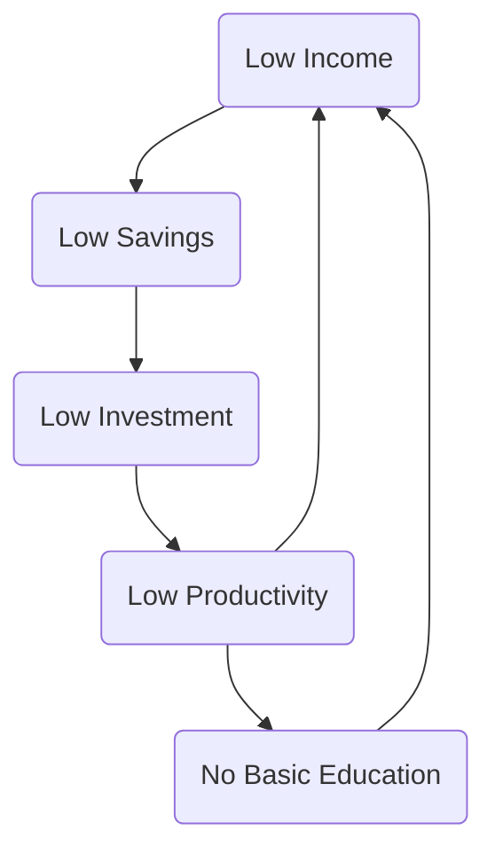

<!--more-->

## FDI

### Provety Cycle




Lower wages than other countries doesn't mean exploit workers.


## Foreign Aid


Foreign Aid is not Foreign Direct Investment


### Humanitarian Motive

### Economic Motive

### Political Motive

As a form of injection into the circular flow of income, foreign aid can help reduce inequalities and unemployment in the ELDCs.

```mermaid
flowchart TB
	
```

### NGOs

### Debt Relief

Agree

- Debt burden reached a level that threatens the sustainability 

## Multilateral Development Assistance (MDA)

