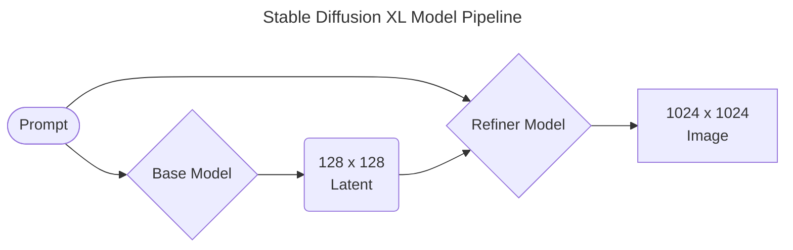

<!--more-->

## 关于AutoDL

### 为什么使用AutoDL

AutoDL是一家出租在线GPU资源的云服务商，我选择它的原因主要是是便宜。

## 容器准备

接下来的内容都默认你会用ssh终端连接，而且会用ftp/sftp上传文件。

### 购买

这里我不想过多赘述，我比较推荐RTX A5000（￥1.24/时），再不行RTX 3090（￥1.66/时），便宜又大碗（显存），有钱的话RTX 4090（￥2.72/时）也不错。

### 安装系统

这里随便选一个镜像即可，因为我们会用到每个镜像都预装的Miniconda来创建自己的虚拟环境，选哪个镜像就没那么重要了。不过记得选CUDA版本高一点的，我这里就选`Miniconda/conda3/3.10(ubuntu)/11.8`镜像了。

### 网络预备

在中国大陆，访问HuggingFace和Github等目标时大概率有问题，所以我会给它配置一个代理。当然，你也开可以使用AutoDL提供的学术加速，但是它的效果并不好。

我这里用Xray的REALITY协议，直接整一个配置文件配合Xray Core在容器里运行，

```json
{
  "dns": {
    "hosts": {
      "domain:googleapis.cn": "googleapis.com"
    },
    "servers": [
      "1.1.1.1"
    ]
  },
  "inbounds": [
    {
      "listen": "127.0.0.1",
      "port": 10808,
      "protocol": "socks",
      "settings": {
        "auth": "noauth",
        "udp": true,
        "userLevel": 8
      },
      "sniffing": {
        "destOverride": [
          "http",
          "tls"
        ],
        "enabled": true
      },
      "tag": "socks"
    },
    {
      "listen": "127.0.0.1",
      "port": 10809,
      "protocol": "http",
      "settings": {
        "userLevel": 8
      },
      "tag": "http"
    }
  ],
  "log": {
    "loglevel": "warning"
  },
  "outbounds": [
    {
      "mux": {
        "concurrency": 8,
        "enabled": false
      },
      "protocol": "vless",
      "settings": {
        "vnext": [
          {
            "address": "", //你自己的服务器地址
            "port": 443, //你自己的端口
            "users": [
              {
                "encryption": "none",
                "flow": "xtls-rprx-vision",
                "id": "", //你自己的UUID
                "level": 8,
                "security": "auto"
              }
            ]
          }
        ]
      },
      "streamSettings": {
        "network": "tcp",
        "realitySettings": {
          "allowInsecure": false,
          "fingerprint": "chrome",
          "publicKey": "", //你自己的公钥
          "serverName": "", //你自己的serverNam
          "shortId": "", //你自己的shortId
          "show": false,
          "spiderX": ""
        },
        "security": "reality",
        "tcpSettings": {
          "header": {
            "type": "none"
          }
        }
      },
      "tag": "proxy"
    },
    {
      "protocol": "freedom",
      "settings": {},
      "tag": "direct"
    },
    {
      "protocol": "blackhole",
      "settings": {
        "response": {
          "type": "http"
        }
      },
      "tag": "block"
    }
  ],
  "policy": {
    "levels": {
      "8": {
        "connIdle": 300,
        "downlinkOnly": 1,
        "handshake": 4,
        "uplinkOnly": 1
      }
    },
    "system": {
      "statsOutboundUplink": true,
      "statsOutboundDownlink": true
    }
  },
  "routing": {
    "domainStrategy": "AsIs",
    "rules": [
      {
        "ip": [
          "1.1.1.1"
        ],
        "outboundTag": "proxy",
        "port": "53",
        "type": "field"
      }
    ]
  },
  "stats": {}
}
```

我在配置文件里指定了监听本地10809端口，

```json
{
  "listen": "127.0.0.1",
  "port": 10809,
  "protocol": "http",
  "settings": {
    "userLevel": 8
  },
  "tag": "http"
}
```

至于服务端如何搭建，那不在本章的讨论范围，个人也只是喜欢REALITY协议的搭配，以上仅供参考。

把这个配置文件命名为`config.json`和Xray Core放在同一个目录下，Core可以去[releases](https://github.com/XTLS/Xray-core/releases)下载。

```text
./Xray
    config.json
    geoip.dat
    geosite.dat
    LICENSE
    README.md
    xray
```

在上传到容器里后，先进入Xray目录：

```bash
cd Xray
```

给xray执行文件赋权：

```bash
chmod +x xray
```

运行xray主程序：

```bash
./xray
```

输出日志类似于：

```text
Xray 1.8.3 (Xray, Penetrates Everything.) Custom (go1.20.2 linux/amd64)
A unified platform for anti-censorship.
2023/07/26 21:53:56 Using default config: /root/Xray/config.json
2023/07/26 21:53:56 [Info] infra/conf/serial: Reading config: /root/Xray/config.json
2023/07/26 21:53:57 [Warning] core: Xray 1.8.3 started
```

## 安装环境

在这个过程中，我们需要完成虚拟环境的创建，因为我们配置好了代理，我建议在AutoPanel中把软件源都改回默认的或者清华源。

### 创建conda环境

启用代理，指向Xray，记得把Xray保持在另一个窗口允许或者用screen放在后台：

```bash
export http_proxy=http://127.0.0.1:10809
export https_proxy=http://127.0.0.1:10809
export all_proxy=http://127.0.0.1:10809
```

创建虚拟环境：

```bash
conda create -n StableDiffusion python=3.10.6
```

Stable Diffusion WebUI的要求是Python 3.10.6，我们在conda中指定了版本号。

激活环境并且初始化：

```bash
conda activate StableDiffusion
conda init
```

现在关闭ssh会话再重新链接，刷新会话后，进入环境：

```bash
conda activate StableDiffusion
```

不出意外的话，你会看见类似于这样的命令行：

```bash
(StableDiffusion) root@autodl-container-z43b11c010-bc19baee:~#
```

说明已经进入`StableDiffusion`环境了。

### 安装SD WebUI包

刷新会话后我们之前通过环境变量添加的代理信息就会失效，此时我们要再启用一次代理，指向Xray，记得把Xray保持在另一个窗口允许或者用screen放在后台：

```bash
export http_proxy=http://127.0.0.1:10809
export https_proxy=http://127.0.0.1:10809
export all_proxy=http://127.0.0.1:10809
git config --global http.proxy http://127.0.0.1:10809
```

这次我们给Git也配置了代理。


每次刷新会话都会使我们临时设置的代理变量失效，比如你网络不好，ssh断开了，重新连回去后就要重新设置一次，不然就没代理效果了。

与此同时，conda的虚拟环境也会掉回base，这时你需要重新激活环境`conda activate StableDiffusion`


Clone Github仓库：

```bash
git clone https://github.com/AUTOMATIC1111/stable-diffusion-webui.git
```

进入`stable-diffusion-webui`目录：

```bash
cd stable-diffusion-webui
```

安装一些pip包：

```bash
pip install -r requirements.txt
```

接下来运行`launch.py`，首次运行它会安装所有我们需要的包：

```bash
python launch.py
```


运行`pip install -r requirements.txt`和`python launch.py`的过程中可能会有报错，这大概率是网络问题，重新运行几次即可。


完成后按`Ctrl + C`中断`launch.py`的运行。

### 安装xformers

xformers可以大大降低显存需求和提高推理速度，对于我来说是必须的。

进入`stable-diffusion-webui/repositories`：

```bash
cd repositories
```

然后拉取xformers的Github库：

```bash
git clone https://github.com/facebookresearch/xformers.git
```

接下来进入repo：

```bash
cd xformers
```

然后把xformers其余的库拉取好：

```bash
git submodule update --init --recursive
```

安装一些pip包：

```bash
pip install -r requirements.txt
```

最后开始编译安装：

```bash
pip install -e .
```


运行`pip install -e .`后你可能发现什么动静都没有，这不是错误，你可以查看CPU占用来确认是否在正常编译，这一过程差不多要消耗2-3小时，请有些耐心。


## 使用SD WebUI

### 清除代理

```bash
all_proxy=http://127.0.0.1:10809
```

这一环境变量会导致WebUI报错，使用前最好刷新一下ssh会话以清除先前的代理变量。

然后重新设定：

```bash
export http_proxy=http://127.0.0.1:10809
export https_proxy=http://127.0.0.1:10809
git config --global http.proxy http://127.0.0.1:10809
```

### 下载模型

大模型/基座模型保存在`models/Stable-diffusion`目录下，我们进入该目录下：

```bash
cd models/Stable-diffusion
```

拿`chilloutmix_NiPrunedFp32Fix.safetensors`作为例子：

```bash
wget "https://civitai.com/api/download/models/11745?type=Model&format=SafeTensor&size=full&fp=fp32" -O chilloutmix_NiPrunedFp32Fix.safetensors
```

我们用`-O`指定了输出文件的名字，这在使用wget的时候很重要。

### 下载LoRA

LoRA模型应该存放在`models/loRA`下，把你想要的LoRA模型放到指定位置即可加载。

拿`FilmVelvia3.safetensors`作为例子，我们下载到对应地方即可：

```bash
cd models/loRA
wget "https://civitai.com/api/download/models/112969?type=Model&format=SafeTensor" -O "FilmVelvia3.safetensors"
```

加载LoRA可以点击WebUI里对应的模型图标，也可以写到Prompt中，格式类似于：

```text
//格式
<lora:loraneme:1:lbw=预设或者分层数字>

//以 "weight" 的权重添加 "example_lora" LoRA 模型
<lora:example_lora:weight>

//以 0.1 的权重添加 "hello_world.safetensors" LoRA 模型
<lora:hello_world:0.1>

//以 0.5 的权重添加 "jamesflare.ckpt" LoRA 模型
<lora:jamesflare:0.5>

//以 0.5 的权重添加 "FilmVelvia3.safetensors" LoRA 模型
<lora:FilmVelvia3:0.5>
```

当然，你也可以用插件加载，详情见[Additional Networks for generating images](/posts/stable-diffusion-autodl/#additional-networks-for-generating-images)。

一个完整例子：

> Positive Prompt: 1girl, smirk, curly hair, rejuvenation, retro, film grain \<lora:chineseAngela_v10:0.6:FACE\> beautiful landscape, \<lora:FilmVelvia3:0.5\>
>
> Negative prompt: (worst quality:2), (low quality:2), (normal quality:2), lowres, atermark, badhandv4, ng_deepnegative_v1_75t

### 添加Textual Inversion

叫它Embedding也行，我更喜欢叫它Embedding而不是Textual Inversion。

它不在什么`models/embedding`目录下，而是在`embeddings`目录下。

拿`bad_pictures.pt`举例，只要放到`embeddings`目录下即可：

```bash
cd embeddings
wget "https://civitai.com/api/download/models/66043?type=Model&format=PickleTensor" -O "bad_pictures.pt"
```

加载的方式和LoRA接近，其一是点一下WebUI中对应Embedding的图标，还有一种是直接在Prompt中填写触发词，而触发词是文件名（不含扩展名）：

```text
bad_pictures
```

一个完整例子：

> Positive Prompt: 1girl, smirk, curly hair, rejuvenation, retro, film grain \<lora:chineseAngela_v10:0.6:FACE\> beautiful landscape
>
> Negative prompt: (worst quality:2), (low quality:2), (normal quality:2), lowres, atermark, badhandv4, ng_deepnegative_v1_75t, bad_pictures

### 加载VAE

VAE（Variational Auto Encoder），也就是变分自编码器，我们此次不过多讨论它的技术细节。

VAE会影响画面，通常是是色彩，但变化可能非常微妙。而且变化只会影响它被优化的部分，比如说，手部。

不过有一点要注意，大多数模型自己已经带了VAE了，这一点需要你查看具体的说明。如果你要加载，有两种方式。

一种是把VAE模型重命名为`vae.pt`后缀放到`model/Stable-diffusion`中。

我们拿`novelai-final-pruned.ckpt`举例，假设它的VAE叫`animevae.pt`，那么我们把它重命名为`novelai-final-pruned.vae.pt`放到`model/Stable-diffusion`中即可。这样它就会被自动加载了，不过注意，VAE模型的格式是`pt`或者`ckpt`这样做都没关系，如果是`safetensors`，那就不能这么干了，得用第二个方法。

另外一种方法是把VAE模型扔到`model/VAE`目录即可，这样的话格式不影响，但是你需要手动加载对应的VAE，不过正因如此我们可以借此尝试组合不同的VAE + 模型组合。

### 下载插件

一种方法是从WebUI里安装，这无需多言，我们讲讲第二种。

插件都在`extensions`目录下，如要安装，我们要进入该目录：

```bash
cd ../..
cd extensions
```

这里拿`sd-webui-roop`做例子，把它Clone到插件目录下：

```bash
git clone https://github.com/s0md3v/sd-webui-roop.git
```

### 启动WebUI

```bash
python3 launch.py --enable-insecure-extension-access --share --port 6006 --no-half-vae --xformers
```

这里我们加了一些参数：

- `--enable-insecure-extension-access`允许我们从WebUI管理插件
- `--share`允许远程访问
- `--port 6006`手动指定监听6006端口
- `--no-half-vae`禁用半精度VAE避免损失精度和报错
- `--xformers`启用xformers

监听了6006端口后就可以从AutoDL那选自定义服务访问了。

## 推荐插件

### Lobe Theme

<a href="https://github.com/canisminor1990/sd-webui-lobe-theme">
  
</a>

它是一个主题，有几个特点，好看，有深色模式，还有Prompt Formater等小功能。唯一的问题是性能消耗恐怖，我这核显直接占用50%。

> 🌗 支持浅色和深色主题，可以在导航栏中快速切换  
> 🌈 支持自定义主题颜色和中性颜色，并提供自定义标志的选项  
> 🪄 支持一键格式化提示符，并提供简单的标签编辑器  
> 🎛️ 高度可定制的侧边栏，左侧有快速设置侧边栏，右侧有模型侧边栏  
> 🖼️ 可调整画布比例，确保生成的图像始终显示在顶部  
> 📱 适用于移动设备，在移动屏幕上进行部分优化  
> 🌍 支持国际化（i18n）并欢迎贡献代码（PR）  
> 📝 在提示输入框中支持语法高亮显示  
> 📦 支持渐进式网络应用程序（PWA）

安装只需要Clone代码库到`extensions`目录即可即可：

```bash
git clone "https://github.com/canisminor1990/sd-webui-lobe-theme" extensions/lobe-theme
```

然后重启WebUI即可。

### Additional Networks for generating images

<a href="https://github.com/kohya-ss/sd-webui-additional-networks">
  
</a>

这个插件可以方便地加载多个LoRA，属于必备插件之一了，安装也不麻烦：

```bash
git clone "https://github.com/kohya-ss/sd-webui-additional-networks.git" extensions/sd-webui-additional-networks
```

然后重启WebUI即可。

有一点要注意，如果你要用它加载LoRA，你需要把LoRA模型放在`extensions/sd-webui-additional-networks/models/lora/`下，才能从插件里加载。

### ControlNet for Stable Diffusion WebUI

<a href="https://github.com/Mikubill/sd-webui-controlnet">
    
</a>

### roop for StableDiffusion

<a href="https://github.com/s0md3v/sd-webui-roop">
  
</a>

这是著名换脸应用roop的Stable Diffusion WebUI版本，安装也不难，先Clone代码库：

```bash
git clone "https://github.com/s0md3v/sd-webui-roop.git" extensions/sd-webui-roop
```

然后安装一些依赖：

```bash
pip install insightface==0.7.3
pip install -r extensions/sd-webui-roop/requirements.txt
```

随后设置一下代理再启动WebUI：

```bash
export http_proxy=http://127.0.0.1:10809
export https_proxy=http://127.0.0.1:10809
git config --global http.proxy http://127.0.0.1:10809
python3 launch.py --enable-insecure-extension-access --share --port 6006 --no-half-vae --xformers
```

在使用的过程中它会下载一些模型。

### !After Detailer

<a href="https://github.com/Bing-su/adetailer">
    
</a>

正如名字一样，它可以针对性地添加细节，通常用来修复面部，手部，或者组合多个通道来获得更好的效果。

| 模型                  | 适用对象      |
|-----------------------|--------------|
| face_yolov8n.pt       | 2D / 真实人脸 |
| face_yolov8s.pt       | 2D / 真实人脸 |
| hand_yolov8n.pt       | 2D / 真实人手 |
| person_yolov8n-seg.pt | 2D / 真实全身 |
| person_yolov8s-seg.pt | 2D/真实全身   |
| mediapipe_face_full   | 真实人脸      |
| mediapipe_face_short  | 真实人脸      |
| mediapipe_face_mesh   | 真实人脸      |

安装它和别的插件也没有过多差别：

```bash
git clone "https://github.com/Bing-su/adetailer.git" extensions/adetailer
```

然后重启WebUI即可。

## 推荐基座模型

### Stable Diffusion XL

SD XL是Stability AI最新发布的基座模型。


{
  "title": {
    "text": "Evaluation of User Preference",
    "left": "center",
    "textStyle": {
      "fontSize": 24
    }
  },
  "tooltip": {},
  "legend": {},
  "xAxis": {
    "data": [
      "SDXL 1.0\n(Base + Refiner)",
      "SDXL 0.9\n(Base + Refiner)",
      "SDXL 1.0\n(Base)",
      "SDXL 0.9\n(Base)",
      "SD 1.5",
      "SD 2.1"
    ],
    "axisLabel": {
      "margin": 14,
      "rotate": -25,
      "interval": 0
    }
  },
  "yAxis": {
    "name": "Preference Win Rate",
    "nameLocation": "end",
    "axisLabel": {
      "formatter": "{value} %"
    }
  },
  "series": [
    {
      "type": "bar",
      "data": [
        {
          "value": 26.2,
          "itemStyle": {
            "color": "#a90000"
          }
        },
        24.4,
        22.7,
        18.7,
        4.63,
        3.42
      ],
      "label": {
        "show": true,
        "position": "top"
      }
    }
  ]
}


> 上面的图表评估了用户对SDXL（带和不带Refiner）相对于SDXL 0.9以及Stable Diffusion 1.5和2.1的偏好。SDXL 1.0基础模型的表现明显优于之前的变体，而结合Refiner的模型则实现了最佳的整体性能。
>
> [**HuggingFace**](https://huggingface.co/stabilityai/stable-diffusion-xl-base-1.0#evaluation)

这是SDXL系列的架构，可以看见它有两个模型，



Base 和 Refiner。

我们把它们放到模型目录即可，SDXL 1.0系列可以直接从HuggingFace下载：

```bash
cd models/Stable-diffusion
wget "https://huggingface.co/stabilityai/stable-diffusion-xl-base-1.0/resolve/main/sd_xl_base_1.0.safetensors" -O sd_xl_base_1.0.safetensors
wget "https://huggingface.co/stabilityai/stable-diffusion-xl-refiner-1.0/resolve/main/sd_xl_refiner_1.0.safetensors" -O sd_xl_refiner_1.0.safetensors
```

- [**stabilityai/stable-diffusion-xl-base-1.0**](https://huggingface.co/stabilityai/stable-diffusion-xl-base-1.0)
- [**stabilityai/stable-diffusion-xl-refiner-1.0**](https://huggingface.co/stabilityai/stable-diffusion-xl-refiner-1.0)

而SDXL 0.9则是需要申请，不过先前被泄露了，可以从我的OSS下载：

```bash
cd models/Stable-diffusion
wget "https://oss.jamesflare.com/models/stable_diffusion/sd_xl_base_0.9.safetensors" -O sd_xl_base_0.9.safetensors
wget "https://oss.jamesflare.com/models/stable_diffusion/sd_xl_refiner_0.9.safetensors" -O sd_xl_refiner_0.9.safetensors
```

还可以通过BitTorrent下载：

```
magnet:?xt=urn:btih:56d304b8c2a40a92af7f6ff52cdf8b80ace9220d
```

值得一提的是，虽然SDXL有惊人的性能，但是许多插件还需要等待适配，而且市面上的LoRA几乎都是基于SD 1.5训练的，这方面的生态还需要完善。

即便如此，它依旧是我最推荐的基座模型。

### Stable Diffusion 2

Stable Diffusion 2相比Stable Diffusion 1，训练的素材尺寸从 $512 \times 512$ 提升到了 $768 \times 768$。由于架构改变，基于SD 1.5的LoRA，大模型等都无法使用，即便是现在，基于SD 2.1训练的模型都寥寥无几。

没有丰富的生态并不影响你使用它画一些风景画。

相比于Stable Diffusion 1，Stable Diffusion 2具有几个优势。首先，它使用了更好的文本编码器，从而实现了更真实、准确地生成图片。其次，它采用了更好的扩散模型，生成的图像更清晰。第三，它可以以更高的分辨率生成图像。

最新的版本是Stable Diffusion 2.1，SD WebUI完整支持了最新的版本。

```bash
cd models/Stable-diffusion
wget "https://huggingface.co/stabilityai/stable-diffusion-2-1/resolve/main/v2-1_768-ema-pruned.safetensors" -O sd_2.1_768-ema-pruned.safetensors
```

还有一个Stable Diffusion 2.1 Base，它训练用的还是和Stable Diffusion 1相同的 $512 \times 512$ 分辨率。

```bash
cd models/Stable-diffusion
wget "https://huggingface.co/stabilityai/stable-diffusion-2-1-base/resolve/main/v2-1_512-ema-pruned.safetensors" -O sd_2.1_512-ema-pruned.safetensors
```

还有一些其它版本的，有兴趣可以研究：

- [**stabilityai/stable-diffusion-2-inpainting**](https://huggingface.co/stabilityai/stable-diffusion-2-inpainting)
- [**stabilityai/stable-diffusion-2-base**](https://huggingface.co/stabilityai/stable-diffusion-2-base)
- [**stabilityai/stable-diffusion-2**](https://huggingface.co/stabilityai/stable-diffusion-2)

### Stable Diffusion 1

Stable Diffusion 1.5是一代经典，恐怕超过九成的大模型和LoRA模型都是用SD 1.5作为底模训练的，生态无疑非常强悍，市场占有率杠杠的。

```bash
cd models/Stable-diffusion
wget "https://huggingface.co/runwayml/stable-diffusion-v1-5/resolve/main/v1-5-pruned-emaonly.safetensors" -O sd_1.5_pruned-emaonly.safetensors
```

如果你希望Fine Tuning模型，那推荐ema+non-ema weights：

```bash
wget "https://huggingface.co/runwayml/stable-diffusion-v1-5/resolve/main/v1-5-pruned.safetensors" -O sd_1.5_pruned.safetensors
```

- [**runwayml/stable-diffusion-v1-5**](https://huggingface.co/runwayml/stable-diffusion-v1-5/tree/main)

还有一些其它版本的，有兴趣可以看看：

- [**CompVis/stable-diffusion-v-1-1-original**](https://huggingface.co/CompVis/stable-diffusion-v-1-1-original)
- [**CompVis/stable-diffusion-v-1-2-original**](https://huggingface.co/CompVis/stable-diffusion-v-1-2-original)
- [**CompVis/stable-diffusion-v-1-3-original**](https://huggingface.co/CompVis/stable-diffusion-v-1-3-original)
- [**CompVis/stable-diffusion-v-1-4-original**](https://huggingface.co/CompVis/stable-diffusion-v-1-4-original)

### Novel AI

2022年10月初，NovelAI的模型意外被黑客盗取并泄露到公网。NovelAI的图像生成模型是使用数个集成8个NVIDIA A100 GPU和1TB内存的计算节点在基于Danbooru的约530万张图片的数据集上对源代码可用的Stable Diffusion模型微调而来的，属于扩散模型。

它严格来说算大模型，但并不是基座模型，不过它训练地实在很彻底，不是画风模型那种简单的微调，我们甚至可以在它的基础上再微调其它的画风并且获得不错的效果，算是爷爷辈的模型了。

要使用它需要下载泄露的文件，有两部分：

#### 第一部分 novelaileak 约52.06GiB

磁力链接：

```
magnet:?xt=urn:btih:5bde442da86265b670a3e5ea3163afad2c6f8ecc
```

目录树：

```text
novelaileak
├─github
│  └─novelai
├─stableckpt
│  ├─animefull-final-pruned
│  ├─animefull-latest
│  ├─animefull-prevgood
│  ├─animesfw-final-pruned
│  ├─animesfw-latest
│  ├─animesfw-prevgood
│  ├─extra-sd-prune
│  │  └─sd-prune
│  ├─modules
│  │  └─modules
│  └─vector_adjust
│      └─vector_adjust
└─workspace
```

文件说明：

```text
- stableckpt/ - Stable Diffusion checkpoints
  - animefull-latest - The model NovelAI uses in production
- workspace/  - Code used to train/run/finetune models
  - sd-private.tar.zst - Stuff to train Stable Diffusion
- github/     - Code taken from GitHub. CREDENTIALS SCRUBBED
  - novelai/  - From NovelAI org
    - *.tar.zst Archived git repos, public AND PRIVATE
- aboutus.gpg - Our public GPG key
- sha256sum   - SHA256 sums of every file
- sha256sum.sig Detached signature for the sums, signed by our GPG key
```

#### 第二部分 novelaileakpt2 约124.53GiB

磁力链接：

```
magnet:?xt=urn:btih:a20087e7807f28476dd7b0b2e0174981709d89cd
```

目录树：

```text
novelaileakpt2
├─prodmodels
└─random_stableckpt
    ├─anime5000
    ├─anime50k
    ├─anime60k
    ├─anime76k
    ├─animefull-final-pruned
    ├─animefull-latest
    ├─animefull2-46k
    ├─animefull46k
    ├─animefullct118k
    ├─animefullct70k
    ├─animefullhq-done
    ├─animefullhq26k
    └─animefulllimitucg8k
```

文件说明：

```text
- random_stableckpt/ - Random Stable Diffusion checkpoints
- prodmodels/ - Production models for GPT I think
- aboutus.gpg - Our public GPG key
- sha256sum   - SHA256 sums of every file
- sha256sum.sig Detached signature for the sums, signed by our GPG key
```

不想通过BT下载的话，你也可以下载互联网上的其它泄露副本。

#### 使用

去前面你下载的`novelaileak/stableckpt`中挑一个你顺眼的模型，这里推荐选择`stableckpt/animefull-final-pruned`，然后把它的`model.ckpt`复制到SD WebUI目录下`models/Stable-diffusion`内，并改个容易辨识的名称，比如`novelai-final-pruned.ckpt`。

同时`stableckpt/animefull-final-pruned`下除了模型还有一个配置文件`config.yaml`，它也是需要的，把它命名为和模型名一致后一同放入SD WebUI目录下`models/Stable-diffusion`内即可。在这里，我们把它命名为`novelai-final-pruned.yaml`。

记得修改`Ignore last layers of CLIP model`，这是NovelAI官方搞的小动作之一，如果将该选项保持默认会和官端有很大差距，将其改成2即可。

NovelAI的包裹里还有许多其它的附件，比如VAE，Hyper Networks等，这些放在题外话里。

## 推荐大模型

## 推荐LoRA

## 推荐Embedding

## 推荐Hyper Networks

## 题外话

### roop for StableDiffusion

插件roop for StableDiffusion限制了NSFW图像，我们可以小小改一下源码。

`scripts/cimage.py`文件长这样：

```python
import tempfile
from ifnude import detect

def convert_to_sd(img):
    shapes = []
    chunks = detect(img)
    for chunk in chunks:
        shapes.append(chunk["score"] > 0.7)
    return [any(shapes), tempfile.NamedTemporaryFile(delete=False, suffix=".png")]
```

这是判断图像是否NSFW的代码，我们把对应部分删除并且修改返回结果即可绕过检测：

```python
import tempfile

def convert_to_sd(img):
    return [False, tempfile.NamedTemporaryFile(delete=False, suffix=".png")]
```

现在只需要重新启动Stable Diffusion WebUI即可。

### NovelAI

