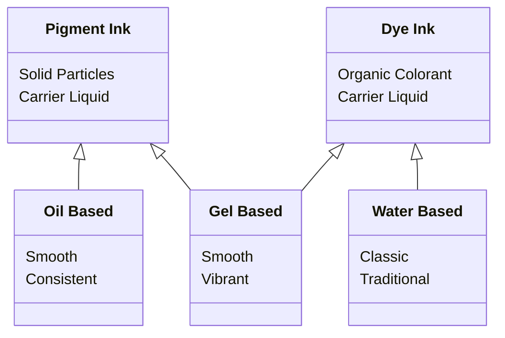

<!--more-->

## Introduction

According to the IB rules, candidates are allowed to use blue or black ink pens for their exams. Gel pens are not allowed for IB official exams.

Many people may think the rule is unclear. So, I am going to discuss what are gel pen and ink pen.

## Why Not Gel Pen

Gel pens are not allowed for IB official exams because the heat from the scanner can erase the ink.

Additionally, gel pens may bleed through the paper, making it difficult to read and scan the exam. IB rules state that candidates should use blue or black ink pens for their exams.

Gel pens are not the only type of pen that is not allowed for IB exams. Highlighters, correction fluid, and other non-permanent writing instruments are also not allowed.

## Pen Type

There are many types of pen.

| Pen Type   | Ink Type           | Writing Experience          | Drying Time | Viscosity             |
|------------|--------------------|-----------------------------|-------------|-----------------------|
| Ballpoint  | Oil-based          | Smoothest, most comfortable | Fastest     | Thickest, most sludgy |
| Gel        | Water-based        | Smoothest, most vivid color | Quick       | Medium                |
| Fountain   | Water-based        | Smoothest, most elegant     | Slow        | Thinnest              |
| Rollerball | Water-based or gel | Smoothest, most precise     | Quick       | Medium                |
| Erasable   | Gel                | Smoothest, most erasable    | Quick       | Medium                |
| Hybrid     | Hybrid ink         | Smoothest, most consistent  | Quick       | Medium                |

## Ink Type

We can class them into 3 main type of ink.

| Ink Type        | Writing Experience           | Drying Time          | Viscosity  |
|---------------|----------------------------|--------------------|----------|
| Oil-based ink   | Smooth and consistent        | Fast to slow         | High       |
| Water-based ink | Classic and traditional feel | Fast to slow         | Low        |
| Gel-based ink   | Smooth and vibrant           | Quick-drying to slow | Fluctuates |

## My Understanding

My understanding od the job of pen based on their explanation is that the ink should be stable and permanent.

Stable means water, heat, light can not make it decolorize. In this way, I think we should talk about the ink type, not the pen type. Generally, the ink can be classed into two type, **Pigment Ink** and **Dye Ink**.

Pigment ink and dye ink are two different types of ink used in printing. The main difference between pigment ink and dye ink is the way the color is delivered to the paper.

**Dye Ink** consists of a colorant that is <u>fully dissolved in a carrier liquid</u>, while **Pigment Ink** consists of <u>very fine solid particles that are suspended in a liquid</u>.

This means that dye ink is absorbed into the paper, while pigment ink sits on top of the paper. Dye ink provides a wider color gamut than pigment ink, resulting in more vivid and colorful prints.

However, **Pigment Ink** is <u>more resistant to fading and water damage</u>, making it a better choice for archival prints. The choice between pigment ink and dye ink depends on the specific printing needs and preferences of the user.

## Test

Most color pens are dye ink, but if you are not sure about the performance of your pen. What about just do some sample tests.



Write some words on a paper.



I tried to erase them out of the paper. From the picture, we can see some part of ink is off. But still distinguishable.



Then, I did some extreme test. First one is water resistance test. We can see the color pen dissolved some pigment off. But not bad.



Finally, I tried heat it to decompose the compound. Normally, dye ink are organic compounds. They are more fragile than pigment ink. But after 160 ℃ for 1 hour. They are still distinguishable.

I believe your test paper can not be worth than this. Don't worry about pens too much.

## End

As long as it's permanent pen, it's OK to use. If you are not sure about that, do a test.