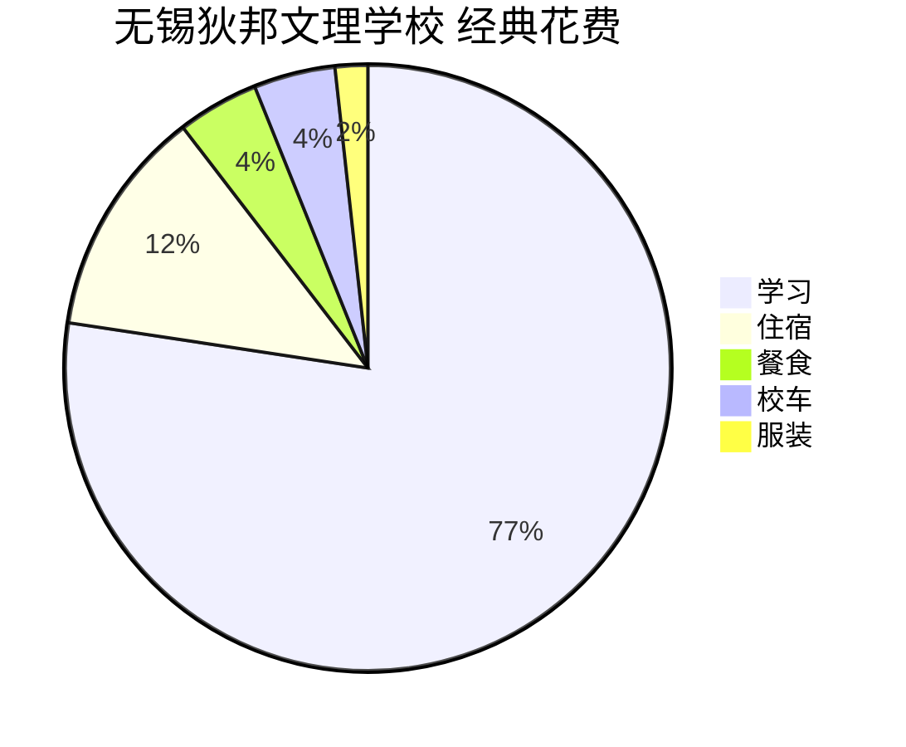

<!--more-->

## 前言

此文章是给想要，将要或已经把子女送入无锡狄邦文理（南外国王）学校就读的家长写的。我将从底层动机开始讲述你应不应该，为什么让你子女在狄邦文理（南外国王）学校就读，也包括我对这所学校的主观评价。当然，如果你是此校的学生，或者将要走上国际教育这条路的同学，那也不是看不得，想必对你思考人生，社会价值有所帮助。

### 狄邦文理

> 无锡狄邦文理学校是经无锡市委、市政府引进，由狄邦教育集团融合南京外国语学校和英国国王学院学校的教育理念创办的一所以能力为导向、着眼未来的创新型学校。学校秉承南外“以人为本”的素质教育理念，汲取国王学院学校“全人教育”的精萃和近200年成功办学经验，通过卓越的学术保障体系、丰富的课程活动体系、完善的学生关顾体系，为3-18岁学生构建一个融贯中西教育、关注个体成长的学习共同体，培养具有民族根基、国际视野、富有创新精神、协作能力及社会责任感的未来青年领袖。
>
> [**NKCSWX.CN**](https://www.nkcswx.cn/about-us/about-kings-college-international-school) Accessed on 2023/3/28

### 我是谁

我叫 James，无锡狄邦文理（南外国王）学校就读的学生。本人在这所学校里走完了整个高中四年历程，在此之前有多个体制内，国际学校的就读经历，也见证了许多所谓“优秀”和“差生”。

## 功利

要想明白为什么要在国际学校就读，或选择无锡狄邦文理（南外国王），我们需要先思考一下我们选择国际化教育的原因，可以先从世俗功利角度开始，即人们在选择国际教育时所追求的实际利益和收益。

### 目的

在开始讨论前，不知大家有没有思考过一个问题，那就是你送子女去国际学校是为了什么？

#### 为了更好的教育

“为了更好的教育”，这是大家最常听见的，首当其冲的。大家不想与国内所谓应试教育竞争，国际学校有更优秀的教育资源等等。一些国家和地区拥有世界上最好的教育资源和学术研究机构，选择国际教育可以让人们获得更好的教育资源和学习机会，提高自己的学术水平和能力。

原因如下：

1. 学习在世界领先的学术机构：世界上一些国家和地区拥有世界领先的大学和研究机构，例如美国、英国、加拿大、澳大利亚等。选择国际教育可以在这些学术机构中学习和研究，获得世界一流的教育资源。

2. 接触国际化教学模式：在国际教育中，人们可以接触到不同的教学模式和课程设置，了解世界各地的教学方法和最新教学技术，从而拓展自己的教育视野。

3. 接触世界级的教师和学者：在国际教育中，人们可以接触到世界级的教师和学者，了解他们的教学和研究成果，参加他们的研讨会和讲座，从而获得前沿的学术知识和研究经验。

4. 获得更广泛的学科选择：在国际教育中，人们可以选择更广泛的学科和专业，例如商科、工科、社会科学、医学、艺术等，从而更好地满足个人的学习需求和兴趣爱好。

5. 获得国际认可的学历和证书：选择国际教育可以获得国际认可的学历和证书，这可以帮助人们在国际化的职场中获得更好的职业发展机会和竞争力。

因此，选择国际教育可以获得更好的教育资源，包括学习在世界领先的学术机构、接触国际化教学模式、接触世界级的教师和学者、获得更广泛的学科选择以及获得国际认可的学历和证书。这些教育资源可以帮助人们获得更好的学术水平和能力，为职业和个人发展打下坚实的基础。

#### 满足个人成长需求

选择国际教育可以让人们体验不同的文化和生活方式，扩展视野，增强自信心和勇气，促进个人成长和发展。

原因如下：

1. 体验不同的文化和生活方式：选择国际教育可以让人们体验不同的文化和生活方式，了解不同的思维方式、价值观和社会制度，从而扩展个人的视野和丰富人生经验。

2. 增强自信心和勇气：选择国际教育需要适应新的环境和文化，需要面对许多挑战和困难，这可以让人们逐渐适应和适应到新的环境中，增强自己的自信心和勇气。

3. 提高语言和跨文化沟通能力：在国际教育中，人们需要学习新的语言、习惯和文化，这可以让人们提高语言和跨文化沟通能力，增强人际交往能力和交流技巧。

4. 培养领导和创新能力：在国际教育中，人们需要独立思考、解决问题和做出决策，这可以培养领导和创新能力，提高个人的组织和管理能力。

5. 学习全球化视野：在国际教育中，人们可以接触到不同国家和地区的学生和教师，了解全球化趋势和挑战，学习如何在国际化的环境中生存和发展。

这些能力和经验都可以帮助人们在职业和个人发展中取得更好的成果。不过我需要提醒，这是从功利角度分析选择国际教育的原因，而不是说无锡狄邦文理学校可以提供这样的内容。

#### 为了上更好的大学

或许你看见有关狄邦文理（南外国王）有许多录取案例，有了选择国际教育上更好的大学的想法。

原因如下：

1. 提高录取竞争力：选择国际教育可以提高个人的语言能力、跨文化沟通能力、领导能力、创新能力等，这些能力都是优秀大学所需要的。因此，选择国际教育可以提高个人在大学申请中的录取竞争力。

2. 获得更好的申请材料：选择国际教育可以获得更好的申请材料，例如成绩单、推荐信、个人陈述等，这可以为个人的大学申请增加筹码，提高被录取的几率。

3. 接触世界一流的大学：选择国际教育可以接触到世界一流的大学和学术机构，了解它们的教学和研究成果，了解它们的教学和研究方向，从而更好地了解个人的大学选择和申请。

4. 获得更好的大学录取机会：在国际教育中，人们可以接触到来自不同国家和地区的大学代表，了解它们的招生政策和录取标准，从而获得更好的大学录取机会。

5. 获得更好的奖学金和资助机会：一些国际教育项目和大学拥有丰富的奖学金和资助机会，这可以帮助个人获得更好的大学教育和学习机会。

因此，选择国际教育是为了上更好的大学，可以提高个人的录取竞争力，获得更好的申请材料，接触世界一流的大学，获得更好的大学录取机会和奖学金资助机会。这些都可以为个人的大学教育和职业发展打下坚实的基础。

#### 为了更多的机会

或许你听见“上国际学校在未来有更多选择”这类的内容。

原因如下：

1. 获得更广泛的人脉资源：在国际教育中，人们可以结交来自不同国家和地区的朋友和同学，这可以拓宽个人的人脉资源，从而获得更多的职业和学习机会。

2. 接触不同的文化和行业：选择国际教育可以让人们接触到不同的文化和行业，了解不同行业的发展趋势和机会，从而更好地规划自己的职业发展。

3. 学习多种语言和文化：在国际教育中，人们可以学习多种语言和文化，这可以让人们更好地适应不同的文化和市场，从而获得更多的机会。

4. 参加国际实习和交换项目：选择国际教育可以参加国际实习和交换项目，这可以让人们在国际化的环境中工作和学习，获得更多的实践经验和机会。

5. 获得国际化的职业和学习机会：选择国际教育可以让人们获得国际化的职业和学习机会，例如国际化的企业、组织和学术研究机构，从而获得更多的机会和挑战。

因此，选择国际教育是为了更多的机会，可以获得更广泛的人脉资源，接触不同的文化和行业，学习多种语言和文化，参加国际实习和交换项目，获得国际化的职业和学习机会。这些机会可以帮助人们在职业和个人发展中获取更多的资源和机会，从而实现自己的梦想和目标。

#### 为了更好的工作

或许你听说“国外大学毕业好找工作，工资高”，国际教育可以提高个人的语言能力、跨文化沟通能力、领导能力、创新能力等，这些能力都是现代企业所需要的。

原因如下：

1. 提高语言能力和跨文化沟通能力：选择国际教育可以提高个人的语言能力和跨文化沟通能力，这是现代企业所需要的。在全球化的背景下，企业需要具备跨文化沟通能力的员工，而选择国际教育可以提高这方面的能力。

2. 增强领导和创新能力：在国际教育中，人们需要独立思考、解决问题和做出决策，这可以培养领导和创新能力，提高个人的组织和管理能力。这些能力可以帮助人们在职场上更好地处理问题和挑战，从而获得更好的职业发展机会。

3. 接触国际化的企业和组织：选择国际教育可以让人们接触到国际化的企业和组织，了解它们的经营模式、管理理念和业务范围，从而更好地规划自己的职业发展方向。

4. 获得国际认可的学历和证书：选择国际教育可以获得国际认可的学历和证书，这可以帮助人们在国际化的职场中获得更好的职业发展机会和竞争力。

5. 增加工作机会和薪酬待遇：选择国际教育可以增加个人的工作机会和薪酬待遇。具备国际化背景和能力的员工更容易被国际化企业和组织所青睐，从而获得更好的职业机会和薪酬待遇。

因此，选择国际教育是为了更好的工作，可以提高语言能力和跨文化沟通能力，增强领导和创新能力，接触国际化的企业和组织，获得国际认可的学历和证书，增加工作机会和薪酬待遇。这些可以为个人的职业发展打下坚实的基础，帮助个人实现职业和个人目标。

### 成本

讲完了目的，我们来讲成本。这里我不希望计算得太精确，只是一个粗略的估算罢了。

#### 国际高中

假设你的子女要在国际高中（无锡狄邦文理学校）上完四年全程，那么[学费](https://www.nkcswx.cn/admissions/fees)是 **￥178k per year**。[住宿费](https://www.nkcswx.cn/admissions/fees)算 **￥28k per year** 好了。每日餐食算 ￥100 好了，中国的学期长度因地区和学校而异，但一般来说，每个学年有两个学期，每个学期大约有 100 天左右，也就是 **￥10k per year**。[校车](https://www.nkcswx.cn/admissions/fees)，姑且算 **￥10k per year** 吧。最后是校服，算 **￥4k per 4 year**。

计算四年总和：

$$
(178k + 28k + 10k + 10k) \times 4 + 4k = 908k
$$

在这四年里你需要花费约 90.8 万人民币。

#### 补习班

这分为学科（Subjects）和语言（TOEFL，IELTS），我写了另外一篇文章来讲述 [**我们该报补习班吗**](/posts/tofel-not)，不过可能还在撰写中。

值得一提的是，狄邦有自家的亲儿子，英锐。你要上的话，那这四年就算 **￥200k** 吧，只多不少。我建议是不上，无论学科还是语言，具体的讨论我会在 [**我们该报补习班吗**](/posts/tofel-not) 里讲述。

## 理想

## 现实

## 学校

## 个人

## 未来

## 最后